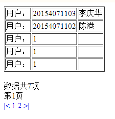
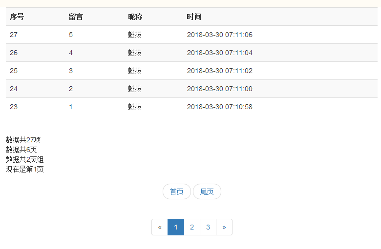

#分页实现
- 简单分页  示例:simplePage.php
> 实现方法：
- 查询统计出总共的记录条数 $total_records
- 给出每页显示条数 $num_rec_per_page
- 计算出总页数 $total_pages
- 计算出每页第一条数据	``` 
	$start_from = ($page-1) * $num_rec_per_page;
	```  
- 查询每页数据
	``` 
	SELECT * FROM user LIMIT $start_from, $num_rec_per_page
	``` 



- 美化分页  示例:beautifyPage.php
> 实现方法：
- 引入了bootstrop


